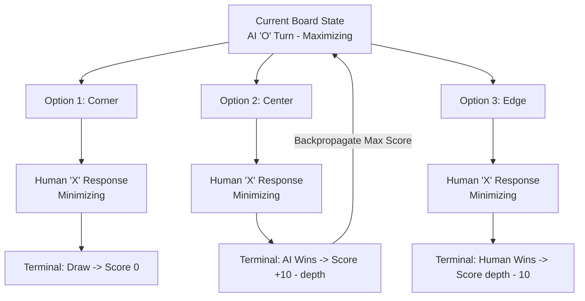

# Unbeatable Tic-Tac-Toe AI

[](https://reactjs.org/)
[](https://developer.mozilla.org/en-US/docs/Web/JavaScript)
[](https://en.wikipedia.org/wiki/Minimax)
[](https://www.w3.org/Style/CSS/)
[](LICENSE)

An interactive, browser-based Tic-Tac-Toe web application built with **React** and powered by the classic **Minimax decision algorithm**. The AI evaluates all prospective terminal states using recursive depth-first tree traversal, making it mathematically impossible to defeat in "Unbeatable" mode.

---

## Minimax Decision Algorithm

The AI operates on game-theoretic principles for zero-sum, perfect-information games. On each computer turn, the algorithm recursively simulates every legal board configuration to determine the move that maximizes the AI's minimum gain:



### Utility Evaluation Matrix

$$\text{Score} = \begin{cases} +10 - \text{depth} & \text{if AI ('O') wins (favors quickest victory)} \\ \text{depth} - 10 & \text{if Human ('X') wins (favors longest defense)} \\ 0 & \text{if Match ends in a Draw} \end{cases}$$

- **Maximizing Player (`O` - AI)**: Chooses the move with the highest utility score.
- **Minimizing Player (`X` - Human)**: Assumed to play optimally, choosing the move with the lowest utility score.

---

## Features

- 🧠 **Mathematically Unbeatable**: In Minimax mode, the AI plays flawless game theory, forcing either an AI victory or a draw.
- 🎮 **Dual Difficulty Modes**:
  - **Unbeatable (Minimax AI)**: Complete recursive state tree search.
  - **Casual (Random)**: Relaxed practice mode against randomized moves.
- 📊 **Real-Time Score Tracker**: Keeps running tally of Player wins, AI wins, and Draws across sessions.
- 🔄 **In-App Round Reset**: Immediate game reset without requiring browser reloads.
- 💅 **Modern Responsive Aesthetics**: Clean card layout, subtle elevation, and responsive mobile-ready board.

---

## Project Structure

```
tictactoe-AI/
├── package.json              # Root workspace convenience scripts
├── .gitignore                # Node and build ignore definitions
├── LICENSE                   # MIT License
├── README.md                 # Project documentation
└── tictactoe/                # React application directory
    ├── package.json          # React dependencies & scripts
    ├── public/
    │   ├── index.html        # HTML entry template
    │   └── manifest.json     # Web app manifest
    └── src/
        ├── App.js            # Core game logic, state machine & Minimax engine
        ├── App.css           # Grid layout, score cards & interactive styling
        ├── index.js          # React DOM entry point
        ├── index.css         # Global typography & base styling
        └── App.test.js       # Smoke and regression tests
```

---

## Getting Started

### Prerequisites

- **Node.js** (v14+ recommended)
- **npm** (v6+)

### Installation

Clone the repository and install dependencies:

```bash
git clone https://github.com/Kalp-S/tictactoe-AI.git
cd tictactoe-AI/tictactoe
npm install
```

### Development Server

Start the local development server:

```bash
npm start
```

Open [http://localhost:3000](http://localhost:3000) in your browser to play.

### Production Build

To compile an optimized static bundle for production:

```bash
npm run build
```

---

## License

This project is licensed under the MIT License - see the [LICENSE](LICENSE) file for details.
